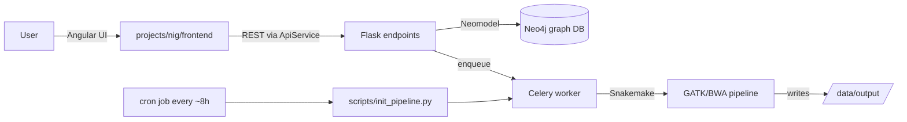

# NIG Repository — Overview

_Last analyzed: 2026-09-04. Confidence: confirmed by reading code unless marked "inferred"._

## What it is

NIG (Network for Italian Genomes repository) is a **platform for managing genomic
and phenotypic datasets**: researchers create Studies, upload FASTQ sequencing files
organized into Datasets, attach Phenotype/Technical metadata, and the platform runs
a GATK-based variant-calling pipeline (Snakemake) asynchronously via Celery,
producing `.g.vcf.gz` output.

## Tech stack (confirmed)

- **Meta-framework**: RAPyDo 2.4 — a scaffolding layer over Flask (backend) + Angular
  (frontend), driven by the `rapydo` CLI and `project_configuration.yaml`.
- **Backend**: Python 3.9, Flask, Marshmallow (`restapi.models.Schema`), Neomodel ORM.
  Endpoint base class: `projects/nig/backend/endpoints/__init__.py` (`NIGEndpoint`).
- **Frontend**: Angular 14, Bootstrap 5.2, ng-bootstrap, NgxFormly (schema-driven forms).
- **Primary datastore**: Neo4j (graph DB) — all domain entities/relationships
  (`projects/nig/backend/models/neo4j.py`).
- **Cache/broker**: Redis, used only through Celery (no direct Redis client code).
- **Task queue**: Celery — async pipeline execution
  (`projects/nig/backend/tasks/`).
- **Pipeline**: Snakemake 6.4.0 + GATK4 + BWA + samtools, run inside the backend
  container via Conda (`projects/nig/backend/snakemake/`).
- **QC**: external submodule `submodules/quality-checks` (`juan.qc.*`), imported
  directly in `projects/nig/backend/tasks/launch_pipeline.py`.

## High-level architecture

## Framework boundary (confirmed)

NIG is a modular monolith operationally assembled by RAPyDo. The application code in
`projects/nig/` does **not** contain a standalone product: authentication/RBAC,
admin/profile/public UI, endpoint discovery, schema/OpenAPI generation, upload/download,
SMTP, Celery wiring, proxy/security controls, test orchestration and backup commands are
inherited from submodules. Maintain NIG changes within this boundary and preserve the
framework integration points described in the other documentation sections.
